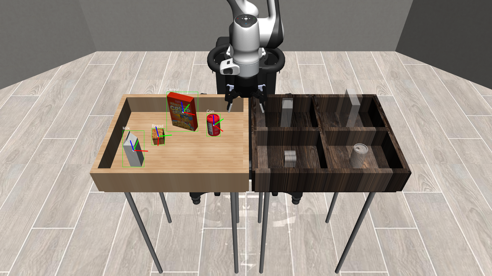

# dev-robosuite-pickplace-control

A robot control pipeline for a pick-and-place task. It drives a robosuite
`PickPlace` simulation (Panda arm + Robotiq85 gripper), using the ONNX
models trained by
[`dev-robosuite-pickplace-vision`](../dev-robosuite-pickplace-vision).

`yolo_detector.onnx` finds each object's box and class. `pose_estimator.onnx`
predicts its position and rotation, in camera-frame xyz. An 11-stage
joint-space state machine then moves the arm to pick each object up and
place it in its bin.



## Table of contents

- [Highlights](#highlights)
- [Requirements](#requirements)
- [Installation](#installation)
- [Project structure](#project-structure)
- [Running](#running)
- [Configuration](#configuration-configconfigyaml)
- [Pipeline](#pipeline-mainpy)
- [Recording](#recording-baserunobserver)
- [Web API](#web-api-srcweb)
- [Code quality](#code-quality)
- [Citation](#citation)

## Highlights

- Full joint-space control. Every tick, a damped-least-squares differential
  IK solve moves the arm's position and yaw, while a separate solve keeps
  the wrist joints (J5/J6) pointed straight down. The two solves never
  fight over the same joints, because the IK step is set up to skip J5/J6
  entirely.
- An 11-stage state machine per object: raise, align, descend, orient yaw,
  fine descend, grasp, lift, re-zero yaw, move to bin, descend into bin,
  release. Each of the four objects (visually and geometrically different)
  gets its own tuning: grasp offsets, release heights, and speed caps.
- A fresh detection scan runs before every object, not just once at the
  start. So an object that started out hidden behind another one becomes
  pickable once that object is gone.
- Recording is fully separate from the control logic, using an observer
  pattern (`BaseRunObserver`). MP4 export, a compact trajectory format for
  the [Web API](#web-api-srcweb), and per-scan diagnostic screenshots are
  three independent listeners on the same five lifecycle hooks. Each can be
  turned on or off. The executor doesn't know any of them exist.
- A FastAPI backend (`src/web/`) can queue and run the pipeline headlessly,
  streaming live progress to a client over a custom binary format
  (`live.bin`) instead of video. No server-side rendering, no video
  streaming. There's no browser client checked into this repo yet, see
  [Web API](#web-api-srcweb) for what does exist.

## Requirements

- Python >= 3.11, < 3.12
- [uv](https://docs.astral.sh/uv/) for dependency management
- `models/yolo_detector.onnx` and `models/pose_estimator.onnx` (trained and
  exported by [`dev-robosuite-pickplace-vision`](../dev-robosuite-pickplace-vision))
- macOS, Windows, or Linux. An NVIDIA GPU is optional (see
  [Installation](#installation))

## Installation

This project uses [uv](https://docs.astral.sh/uv/). Pick the extra that
matches your hardware:

```bash
uv sync --extra cpu
```

```bash
uv sync --extra mps
```

```bash
uv sync --extra gpu
```

`cpu` and `mps` use the standard torch wheels (CPU / macOS with MPS
support). `gpu` installs torch with CUDA 12.4 and `onnxruntime-gpu`.

Both running modes below need `models/yolo_detector.onnx` and
`models/pose_estimator.onnx` to be present (copy the latest trained and
exported models from `dev-robosuite-pickplace-vision` if you're updating
them).

Detection and pose inference run on ONNX Runtime. They use an NVIDIA GPU
automatically when one is available (`CUDAExecutionProvider`), and fall
back to CPU otherwise (`src/vision/onnx_detector.py`,
`src/vision/pose_estimator.py`). macOS has no CUDA support, so inference
always runs on CPU there.

## Project structure

```
dev-robosuite-pickplace-control/
├── config/
│   ├── config.yaml                     # detector/pose/environment/motion/stage tuning (see below)
│   ├── joint_position_controller.json  # robosuite composite controller config (see below)
│   └── logging.yaml                    # stdlib logging.dictConfig
├── models/
│   ├── yolo_detector.onnx   # copied from dev-robosuite-pickplace-vision
│   └── pose_estimator.onnx  # copied from dev-robosuite-pickplace-vision
├── main.py                  # entrypoint
└── src/
    ├── control/
    │   ├── joint_motion.py              # differential IK + J5/J6 posture control
    │   ├── pickplace_controller.py      # 11-stage state machine
    │   └── stage.py                     # shared stage order
    ├── environments/
    │   └── pickplace_with_robot_offset.py # PickPlace env + robot base offset
    ├── execution/
    │   └── pickplace_executor.py        # builds env, runs vision, drives PickPlaceController
    ├── geometry/
    │   └── coordinate_transform.py      # camera-frame -> world-frame, rotation -> yaw
    ├── recording/
    │   ├── run_observer.py              # BaseRunObserver hook contract
    │   ├── factory.py                   # builds the observers one run's config enables
    │   ├── trajectory_recorder.py       # portable model + qpos recording for web playback
    │   ├── trajectory_observer.py       # drives TrajectoryRecorder from executor hooks
    │   ├── video_recorder.py            # agentview + frontview MP4 writer
    │   ├── video_observer.py            # drives VideoRecorder, adds detection/pose overlays
    │   └── scan_image_observer.py       # saves an annotated PNG per detection scan
    ├── util/
    │   ├── logging_configurator.py      # logging.yaml-driven setup
    │   ├── system_configurator.py       # ConfigReader/ConfigAssembler/SystemConfigurator.load()
    │   └── types.py                     # shared configuration and state data
    ├── vision/
    │   ├── onnx_detector.py             # YOLO ONNX inference
    │   └── pose_estimator.py            # pose_estimator.onnx inference
    └── web/
        ├── app.py                       # FastAPI routes: queue runs, serve trajectories/model
        ├── simulation_jobs.py           # job registry: state, run dirs, disk cleanup
        └── worker.py                    # subprocess entrypoint for one queued run
```

## Running

```bash
# macOS
uv run mjpython main.py

# Windows / Linux
uv run python main.py
```

Whether an interactive viewer window opens depends on
`VISUALIZATION.VIDEO_ENABLED` in `config/config.yaml` (see
[Configuration](#configuration-configconfigyaml)), not on which command you
run. `main()` opens the viewer only when `VIDEO_ENABLED` is `false`
([`main.py`](main.py)). Set it to `true` instead for a headless run that
records an MP4. The command you run stays the same either way.
`TRAJECTORY_ENABLED` doesn't affect this at all, so it's fine to leave it
on while watching the viewer. Combining the viewer with video recording
does work (confirmed on Windows), but it roughly doubles the time per
stage, so it isn't the default.

macOS needs MuJoCo's interactive viewer to run on the main thread.
`mjpython` (bundled with the `mujoco` package) provides that. Headless
MuJoCo rendering needs a different window context, which conflicts with
`mjpython`. So on macOS specifically, use plain `python` (not `mjpython`)
for MP4 recording and for the web API's worker process. Both always run
headless, by passing `has_renderer=False` explicitly. Windows and Linux
don't have this problem: the same `python` interpreter handles both the
interactive viewer and headless runs.

## Configuration (`config/config.yaml`)

[`src/util/system_configurator.py`](src/util/system_configurator.py) reads
`config/config.yaml` in two stages. `ConfigReader.read()` parses the YAML
into a raw `dict`. `ConfigAssembler.assemble()` then builds a typed
`Config` (`src/util/types.py`) from it, one dataclass per section.
`SystemConfigurator.load()` is the only entrypoint used.

Most keys are required: a missing one raises `KeyError`. Only a handful are
optional with a fallback: `VISUALIZATION.*`, `MOTION.JOINT5_NAME`,
`MOTION.JOINT6_HOME_DEG`, and `STAGES.FINE_DESCEND_MAX_POSITION_DELTAS`. So
the values below (not the dataclass defaults in `types.py`) are what
actually runs.

### `DETECTOR`

| Key | Description | Default |
|---|---|---|
| `MODEL_PATH` | ONNX detector loaded for inference. | `models/yolo_detector.onnx` |
| `CLASS_NAMES` | Class names indexed by the model's class ID (fixed training order). | `[Bread, Can, Cereal, Milk]` |
| `IMAGE_SIZE` | Square input resolution (pixels). | `640` |
| `CONF_THRESHOLD` | Minimum detection confidence to keep a box. | `0.50` |
| `IOU_THRESHOLD` | IoU threshold used by NMS to suppress overlapping boxes. | `0.45` |

### `POSE`

| Key | Description | Default |
|---|---|---|
| `MODEL_PATH` | ONNX `PoseEstimator` model. | `models/pose_estimator.onnx` |
| `POS_IMAGE_SIZE` | Input size of the full agentview frame fed to the xyz stream. | `320` |
| `ROTATION_IMAGE_SIZE` | Input size of the cropped object image fed to the rotation stream. | `128` |
| `ROTATION_SYMMETRIC_CLASSES` | Classes with no meaningful "correct" rotation to compare against (e.g. a can looks and grasps the same at any yaw). Excluded from the per-scan rotation-error logging and the `RunResult` average, both of which compare the vision model's predictions against the simulator's own ground-truth object poses (`PickPlaceExecutor._pose_errors`). Position is unaffected. | `[Can]` |

### `ENVIRONMENT`

| Key | Description | Default |
|---|---|---|
| `SEED` | robosuite scene-layout seed; `null` randomizes the layout every run. | `null` |
| `ROBOT_BASE_OFFSET` | World-frame `[x, y, z]` offset added on top of robosuite's own default Panda base position. | `[0.10, 0.10, 0.0]` |

### `EXECUTION`

| Key | Description | Default |
|---|---|---|
| `TARGET_CLASSES` | Classes and the order the run picks and places them in. Independent of `DETECTOR.CLASS_NAMES`'s alphabetical class-ID order. | `[Cereal, Milk, Can, Bread]` |

### `VISUALIZATION`

| Key | Description | Default |
|---|---|---|
| `VIDEO_ENABLED` | Record agent-view/front-view MP4s. | `false` |
| `VIDEO_PATH` | Base output path for the generated MP4s. | `outputs/pickplace.mp4` |
| `VIDEO_FPS` | Output video playback frame rate. | `30` |
| `VIDEO_CAPTURE_EVERY_TICKS` | Controller ticks between recorded frames. | `6` |
| `TRAJECTORY_ENABLED` | Export a compact `qpos` trajectory plus a reusable MJCF model, consumed by the [Web API](#web-api-srcweb). | `false` |
| `TRAJECTORY_PATH` | Output binary path for the recorded trajectory. | `outputs/trajectory/trajectory.bin` |
| `TRAJECTORY_MODEL_PATH` | Output ZIP path for the packaged MJCF scene model. | `outputs/trajectory/model.zip` |
| `SCAN_IMAGES_ENABLED` | Save an annotated PNG per detection scan, plus one raw opening capture. | `true` |
| `SCAN_IMAGES_DIR` | Directory the scan PNGs are written into. | `outputs/scans` |

### `MOTION`

| Key | Description | Default |
|---|---|---|
| `JOINT5_NAME` | robosuite joint name for wrist joint J5; `null` disables the joint J5+J6 solve in favor of a J6-only fallback. | `robot0_joint5` |
| `JOINT5_KP` | Proportional gain for the J5 tracking correction. | `4.0` |
| `JOINT5_DOWN_TOLERANCE_DEG` | J5 convergence tolerance for "pointing straight down". | `1.0` |
| `JOINT6_NAME` | robosuite joint name for wrist joint J6. | `robot0_joint6` |
| `LOCK_JOINT6` | If true, hard-overwrites the final J6 target after IK instead of trusting convergence. | `false` |
| `JOINT6_KP` | Proportional gain for the J6 tracking correction. | `4.0` |
| `JOINT6_DOWN_TOLERANCE_DEG` | J6 convergence tolerance. | `1.0` |
| `JOINT7_KP` | Proportional gain for the explicit Joint-7 branch of `JointMotion.action()`. | `4.0` |
| `YAW_JOINT_INDEX` | Arm-action array index of the yaw joint (J7). | `6` |
| `YAW_MAX_STEP_DEG` | Per-tick cap on yaw-stage correction. | `4.0` |
| `MAX_JOINT_DELTA` | Per-tick cap on the IK solution's largest joint-angle component. | `0.05` |
| `MAX_WRIST_JOINT_DELTA` | Separate, larger per-tick cap for the J5/J6 tracking correction. | `0.10` |
| `POSITION_KP` | Proportional gain on Cartesian position error. | `4.0` |
| `ORIENTATION_KP` | Proportional gain on orientation error. | `1.0` |
| `ORIENTATION_WEIGHT` | Base weight of orientation correction; `0.0` unless a stage explicitly holds world yaw. | `0.0` |
| `MAX_POSITION_DELTA` | Default per-tick Cartesian step cap (metres); stages may override it. | `0.03` |
| `MAX_ORIENTATION_DELTA` | Per-tick cap (radians) on orientation correction. | `0.10` |
| `IK_DAMPING` | Levenberg damping coefficient in the damped-least-squares IK solve. | `0.03` |
| `GRIPPER_CLAMP_FORCE_MULTIPLIER` | Multiplier applied to the Robotiq85 finger actuator force. | `1.05` |
| `JOINT6_HOME_DEG` *(optional, unset)* | If set, each new object's J6 target starts here instead of the robot's current J6 angle. | *unset* |

### `STAGES`

| Key | Description | Default |
|---|---|---|
| `APPROACH_HEIGHT` | Shared world-Z used for safe horizontal travel between stages. | `1.2` |
| `DESCEND_CLEARANCE` | Z clearance above the object for the coarse descend stage. | `0.12` |
| `FINE_DESCEND_OFFSETS` | Per-class final-approach Z offset, correcting each mesh's real contact height vs. its reported origin. | `{Cereal: 0.018, Milk: 0.022, Can: -0.003, Bread: -0.003}` |
| `FINE_DESCEND_MAX_POSITION_DELTAS` | Per-class cap on per-tick position change during fine descent, gentler than `MAX_POSITION_DELTA`. | `{Bread: 0.005, Can: 0.015, Cereal: 0.015, Milk: 0.005}` |
| `BIN_RELEASE_HEIGHTS` | Per-class absolute end-effector world-Z at release. | `{Cereal: 0.95, Milk: 0.95, Can: 0.95, Bread: 0.85}` |
| `POSITION_TOLERANCE` | Default Cartesian convergence tolerance. | `0.005` |
| `BIN_RELEASE_TOLERANCE` | Tighter tolerance specific to the bin-release stage. | `0.005` |
| `YAW_TOLERANCE_DEG` | Yaw convergence tolerance. | `0.8` |
| `GRASP_DWELL_TICKS` | Ticks the gripper is held closing before checking the grasp. | `40` |
| `GRASP_MIN_LIFT_HEIGHT` | Minimum object rise (metres) required before a lift counts as successful. | `0.03` |
| `GRASP_YAW_OFFSET_DEG` | Constant added to the detected grasp yaw before symmetry-folding. | `0.0` |
| `RELEASE_DWELL_TICKS` | Ticks the gripper is held opening on release. | `50` |
| `MAX_TICKS_PER_STAGE` | Per-stage tick budget; exceeding it raises instead of correcting forever. | `1500` |
| `LOG_EVERY_TICKS` | Interval for periodic progress log lines. | `20` |
| `OPEN_GRIPPER` / `CLOSED_GRIPPER` | Gripper actuator command values. | `-0.05` / `1.0` |

### `config/joint_position_controller.json`

This isn't a `config.yaml` key.
[`PickPlaceExecutor._init_env`](src/execution/pickplace_executor.py) loads
it directly, by its hardcoded path, using robosuite's
`load_composite_controller_config()`, and passes it as `controller_configs`
to `suite.make(...)`.

It's what makes the whole pipeline joint-space (`"type": "JOINT_POSITION"`,
absolute input, plus/minus 6.28 rad) instead of robosuite's default
operational-space control. That's what the damped-least-squares IK
approach in [Highlights](#highlights) depends on.

## Pipeline (`main.py`)

### Step 1: Environment (`PickPlaceWithRobotOffset`, [`src/environments/pickplace_with_robot_offset.py`](src/environments/pickplace_with_robot_offset.py))

A minimal subclass of robosuite's `PickPlace` task. Its only job is making
the Panda's base position configurable, without touching object, bin,
reward, or observation logic.

`PickPlaceExecutor._init_env` builds the environment via
`robosuite.suite.make(..., robots="Panda", gripper_types="Robotiq85Gripper",
controller_configs=load_composite_controller_config(...), ...)`. The
controller config is
[`config/joint_position_controller.json`](#configjoint_position_controllerjson),
the setting that puts the whole pipeline in joint-space control instead of
robosuite's default OSC.

It also passes `has_offscreen_renderer=False, use_camera_obs=False`,
turning off robosuite's own camera pipeline entirely. Why? With it on,
robosuite renders a full agentview frame on every single `env.step()`. The
executor only needs one frame per detection scan, so it renders that frame
directly via `mujoco.Renderer` instead.

`_load_model()` reads robosuite's own default Panda base position for the
"bins" arena (`robot_model.base_xpos_offset["bins"]`) and adds
`ENVIRONMENT.ROBOT_BASE_OFFSET` on top of it. The offset is additive, not
relative to the world origin, so it can be used to stress-test the
controller's reach margins without editing robosuite itself. It's skipped
entirely when the offset is all-zero.

### Step 2: Detection (`OnnxDetector`, [`src/vision/onnx_detector.py`](src/vision/onnx_detector.py))

`PickPlaceExecutor._detect_targets` crops the agentview frame to
`CropRegion` and runs it through `OnnxDetector.predict()`:

- `_letterbox` resizes it into a `DETECTOR.IMAGE_SIZE` square, preserving
  aspect ratio with black padding.
- `_to_blob` converts BGR to RGB and normalizes it to NCHW.
- The ONNX session (`CUDAExecutionProvider`, falling back to
  `CPUExecutionProvider`) returns raw YOLO predictions.
- `_postprocess` filters those by `DETECTOR.CONF_THRESHOLD`, runs
  `cv2.dnn.NMSBoxes` at `DETECTOR.IOU_THRESHOLD`, and un-letterboxes the
  result back into the cropped image's pixel space.

Every configured class visible in the frame is kept, not just the one the
current scan is looking for. An object waiting its turn stays tracked, so
it can be picked without a second scan once it's up.

### Step 3: Pose estimation (`PoseEstimator`, [`src/vision/pose_estimator.py`](src/vision/pose_estimator.py))

For each kept detection, `PoseEstimator.predict()` builds four inputs, in
the model's fixed order:

- the full agentview frame, resized to `POSE.POS_IMAGE_SIZE` (context for
  the xyz stream),
- normalized bbox coordinates, plus derived area and center,
- a one-hot class vector,
- the detection's own crop, resized to `POSE.ROTATION_IMAGE_SIZE` (detail
  for the rotation stream), falling back to the full frame if the crop is
  degenerate.

The ONNX session returns a camera-frame `xyz` and a 6D rotation vector.
`PoseEstimator.rot6d_to_matrix` turns that 6D vector into a proper 3x3
rotation matrix, via Gram-Schmidt orthogonalization (the Zhou et al., 2019
representation, matching the training convention in
[`dev-robosuite-pickplace-vision`](../dev-robosuite-pickplace-vision)).

### Step 4: Coordinate transform (`CoordinateTransformer`, [`src/geometry/coordinate_transform.py`](src/geometry/coordinate_transform.py))

`camera_to_world_frame(xyz_cam, rot_cam, cam_xpos, cam_xmat)` computes
`world_xpos = cam_xmat @ xyz_cam + cam_xpos` and `world_xmat = cam_xmat @
rot_cam`.

This is the exact algebraic inverse of the vision repo's
`world_to_camera_frame` (`cam_xmat.T @ (...)`). It works because
`cam_xmat` is an orthonormal rotation matrix, so its transpose is also its
inverse. One repo strips the camera transform out, to build training
targets. This one puts it back, to turn predictions into robot-frame
poses.

It then permutes `world_xmat`'s columns into the "green axis"
grasp-alignment convention used at training-label time. It extracts a yaw
angle via `scipy.spatial.transform.Rotation`, and wraps it into `[-90°,
90°]`. A 180° turn about the vertical axis is an equivalent grasp for all
four object classes, so yaw only needs resolving modulo 180°, not the full
360°.

The camera's own world position and rotation (`cam_xpos`/`cam_xmat`) are
read once, from `env.sim.data.cam_xpos`/`cam_xmat`, at executor init, and
reused for every scan, since the camera itself never moves.

### Step 5: Control (`PickPlaceController`, `JointMotion`, [`src/control/`](src/control/))

`PickPlaceController.run()` drives one object through an 11-stage state
machine (`Stage`, [`src/control/stage.py`](src/control/stage.py)). The
execution order lives in `run()`'s stage transitions, not in `Stage`'s
numeric values, which are only kept for log compatibility with earlier
experiments:

1. **RAISE**: rise to a shared safe travel height above the table.
2. **ALIGN_XY**: move horizontally to the detected object, still at travel height.
3. **DESCEND**: drop to just above the object. `Can` (cylindrical, rotationally symmetric) skips straight to `FINE_DESCEND`; every other class goes through `ORIENT_YAW` first.
4. **ORIENT_YAW**: rotate joint 7 only, toward the detected grasp yaw. The yaw gets folded to its nearest 180°-symmetric equivalent first, so the wrist never takes the long way round.
5. **FINE_DESCEND**: the final, slower approach to contact height. A small per-class Z correction compensates for each mesh's real contact point versus its reported origin.
6. **GRASP**: hold pose, close the gripper, and verify contact.
7. **LIFT**: rise back to travel height. Convergence requires the object to still be grasped and to have risen a minimum height. This catches a "grasp" that's really just resting between the fingers.
8. **REZERO_YAW**: a second joint-7-only stage. It re-zeros the wrist to a canonical orientation before transport, regardless of what grasp yaw stage 4 needed.
9. **MOVE_TO_BIN**: travel to the target bin at travel height, holding the re-zeroed orientation.
10. **DESCEND_TO_BIN**: drop to a per-class absolute release height inside the bin, at a tighter tolerance than transit stages.
11. **RELEASE**: hold pose and open the gripper.

Every Cartesian stage also carries a wrist target, and only advances once
both position and wrist orientation have converged. A stage stuck for
`STAGES.MAX_TICKS_PER_STAGE` ticks raises rather than correcting forever.

`JointMotion.action()` ([`src/control/joint_motion.py`](src/control/joint_motion.py))
turns one Cartesian pose command into a 7-joint absolute-position action,
every tick. It always takes one small, bounded step from the robot's
current measured joints. It never teleports.

- **Position**: the error is scaled proportionally and clamped
  (`MOTION.MAX_POSITION_DELTA`). The XY vector is rescaled as a whole,
  rather than clipping each axis independently, to keep multi-axis moves on
  a straight line.
- **Orientation**: correction is off by default, and only active for stages
  that explicitly hold world yaw.
- **The Cartesian step itself** comes from a **damped-least-squares
  differential IK** solve (`mujoco.mj_jacSite` at the gripper site, damping
  = `MOTION.IK_DAMPING`), restricted to position and yaw. Roll and pitch
  are deliberately excluded from this Jacobian, so they never fight the
  separate **J5/J6 wrist solve** (below).
- **The J5/J6 wrist solve** re-derives, every tick, the joint angles that
  keep the tool's Z-axis pointing straight down. It does this via local
  forward-kinematics optimization (SciPy `least_squares` over J5+J6
  jointly, or a 1-D fallback if J5 isn't configured), blended in through a
  feedforward-plus-proportional tracking correction, so the joint can keep
  up with a wrist target that shifts every tick.

Yaw-only stages (`ORIENT_YAW`/`REZERO_YAW`) work differently: they hold
every other joint at its current position and step only joint 7, so a yaw
correction can never accidentally translate the gripper off the object.

## Recording (`BaseRunObserver`)

Recording is entirely separate from the pick-and-place logic.
`PickPlaceExecutor` only reports what happens, through five lifecycle hooks
defined by the `BaseRunObserver` ABC
([`src/recording/run_observer.py`](src/recording/run_observer.py)):

- `on_run_start`: once, after `env.reset()`.
- `on_scan` / `on_target_detected`: per detection scan, before every object.
- `on_step`: after every controller tick.
- `on_run_end`: once, in a `finally` block, so a crashed or
  early-terminated run still gets whatever it captured.

[`src/recording/factory.py`](src/recording/factory.py)'s `build_observers()`
reads `VisualizationConfig` and builds any subset of the three observers
below. Each one ignores the hooks it has no use for.

### Video (`VideoObserver`, [`src/recording/video_observer.py`](src/recording/video_observer.py))

Set `VISUALIZATION.VIDEO_ENABLED` to `true`, then run the headless command
above. Two Full-HD (1920x1080) MP4s are written by default:
`outputs/pickplace_agentview.mp4` and `outputs/pickplace_frontview.mp4`.
They're downsampled to one captured tick every `VIDEO_CAPTURE_EVERY_TICKS`
(6 by default), to bound render time, using a fast H.264 preset.

The detection overlay (box, label, red-X/green-Y/blue-Z pose axes) is only
drawn during the pre-grasp approach stages (`RAISE` through
`FINE_DESCEND`). It marks where the scan detected the object, which stops
being accurate the moment the gripper starts moving it.

The front-view box has no detector of its own behind it. Instead, it comes
from a MuJoCo segmentation render of the object's visual geometry, so
occlusion by the bin walls resolves correctly for free.

### Trajectory (`TrajectoryObserver`, [`src/recording/trajectory_observer.py`](src/recording/trajectory_observer.py))

Set `VISUALIZATION.TRAJECTORY_ENABLED` to `true` to export a compact
recording, consumed by the [Web API](#web-api-srcweb). It writes three
files, derived from `TRAJECTORY_PATH`/`TRAJECTORY_MODEL_PATH`:

- `model.zip`: the run's packaged MJCF scene, exported at `on_run_start` so
  a client could render it within seconds, well before the run finishes.
- `live.bin`: an append-only file of fixed-stride binary records
  (`time:f32, qpos:f32[nq], object:u8, stage:u8, pad:u8[2]`), flushed after
  every tick, so a concurrent reader sees growth without waiting for the
  process to exit.
- `trajectory.bin`: the final recording, a compact length-prefixed-header
  binary, written once at `on_run_end`.

Every recorded frame is the complete MuJoCo `qpos` vector. So replaying one
is just re-applying recorded `qpos` frames against the packaged scene. No
need to re-run the controller or physics.

### Scan images (`ScanImageObserver`, [`src/recording/scan_image_observer.py`](src/recording/scan_image_observer.py))

`VISUALIZATION.SCAN_IMAGES_ENABLED` is on by default. Every detection scan
saves an annotated `outputs/scans/scan_NN_agentview.png` (box, label, and
pose axes for every detected object, not just the one currently sought), and
the very first scan also saves an unannotated `outputs/scans/raw_agentview.png`
of the opening scene, for documentation. Set `SCAN_IMAGES_DIR` to change
where they're written.

## Web API (`src/web/`)

[`src/web/`](src/web/) is a FastAPI backend that queues and runs headless
pipeline simulations, streaming their progress as a compact binary. It
reuses the same `live.bin`/`trajectory.bin`/`model.zip` format the
[Trajectory observer](#trajectory-trajectoryobserver-srcrecordingtrajectory_observerpy)
writes.

There's currently no browser client checked into this repo. (The
`.gitignore` entries for `src/web/player/node_modules/` and `dist/` are
forward-looking: no `src/web/player/` directory exists yet.) The API can be
used directly instead, for example with `curl` or a REST client.

Start it with:

```bash
uv run uvicorn src.web.app:app --reload
```

### Backend (`SimulationJobs`, [`src/web/`](src/web/))

[`app.py`](src/web/app.py) is a thin FastAPI layer over one module-level
`SimulationJobs` registry ([`simulation_jobs.py`](src/web/simulation_jobs.py)).
Every route just delegates to it.

`POST /api/simulations` refuses with `409` while another run is in progress
(only one headless simulation runs at a time). Otherwise, it writes
`request.json` into a fresh `outputs/web/runs/<job_id>/` directory, and
spawns [`worker.py`](src/web/worker.py) as a **detached subprocess**
(`python -m src.web.worker <request.json>`, in its own process group, so it
survives the API process restarting).

`worker.py` builds a request-specific config via `dataclasses.replace`
(seed, target classes, trajectory export forced on, video forced off), and
passes it to `main()` along with `has_renderer=False`. It then writes
`result.json` on success, or `error.json` on any exception.

> **Known gap:** `main()` currently ignores the `config` object it's
> passed, and always calls `SystemConfigurator.load()` instead, which
> re-reads `config/config.yaml` from disk. Only `has_renderer=False` (a
> separate keyword argument, which `main()` does honor) actually takes
> effect for a web-triggered run. The per-request seed, target-classes, and
> trajectory overrides that `worker.py` builds don't yet reach the
> pipeline. So a web run currently behaves like any other run of whatever
> `config.yaml` says.

`SimulationJobs.refresh()` works out a job's status purely from what's on
disk, each time it's called:

- `result.json` exists: `completed`.
- `error.json` exists: `failed`.
- the tracked process is still alive: `running`, or `paused` if a
  `paused.flag` file exists in the run directory.
- otherwise: `stopped`, or a hard-crash `failed`.

Pause/resume/stop are implemented as filesystem signals. `POST .../pause`
touches `paused.flag`, which `PickPlaceExecutor._wait_while_paused` polls
between controller ticks. `POST .../stop` terminates the worker process,
keeping whatever it streamed so far.

`GET .../live` and `GET .../live/frames?from=N` expose the same
fixed-stride `live.bin` the trajectory observer writes, letting a client
follow a run while it's still in progress. `/live/frames` only ever serves
whole frames, so a partially-written trailing record from a concurrently
writing worker is never sent.

`GET .../trajectory` serves the final `trajectory.bin`. `GET /api/model`
serves the packaged scene `model.zip` (written once at `on_run_start`, so
it's ready well before the run finishes). `GET /api/health` is a plain
liveness check.

Run folders older than a day (by directory mtime) are deleted
automatically, the next time a simulation is started.

## Code quality

Install the Git hook once after cloning:

```bash
uv run pre-commit install
```

Run every hook manually when needed:

```bash
uv run pre-commit run --all-files
```

## Citation

This project uses [robosuite](https://robosuite.ai/). If you use robosuite in
work based on this project, cite:

```bibtex
@inproceedings{robosuite2020,
  title={robosuite: A Modular Simulation Framework and Benchmark for Robot Learning},
  author={Yuke Zhu and Josiah Wong and Ajay Mandlekar and Roberto Mart\'{i}n-Mart\'{i}n and Abhishek Joshi and Soroush Nasiriany and Yifeng Zhu and Kevin Lin},
  booktitle={arXiv preprint arXiv:2009.12293},
  year={2020}
}
```
